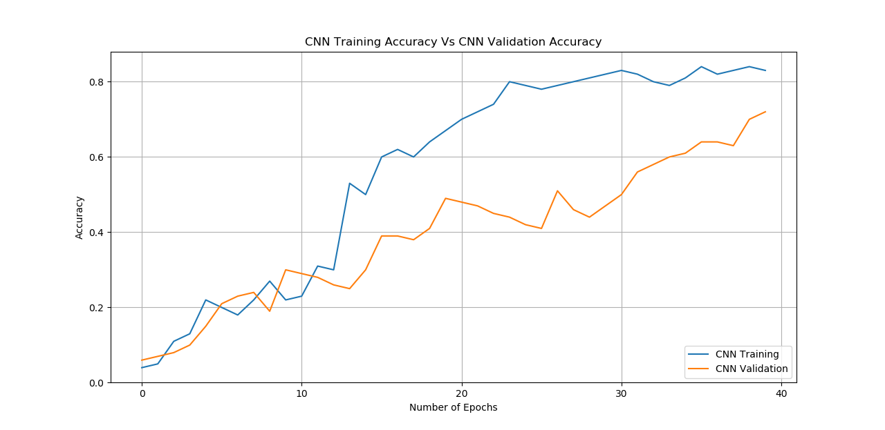
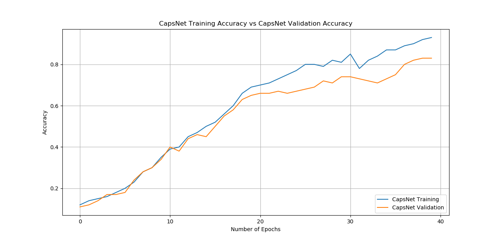
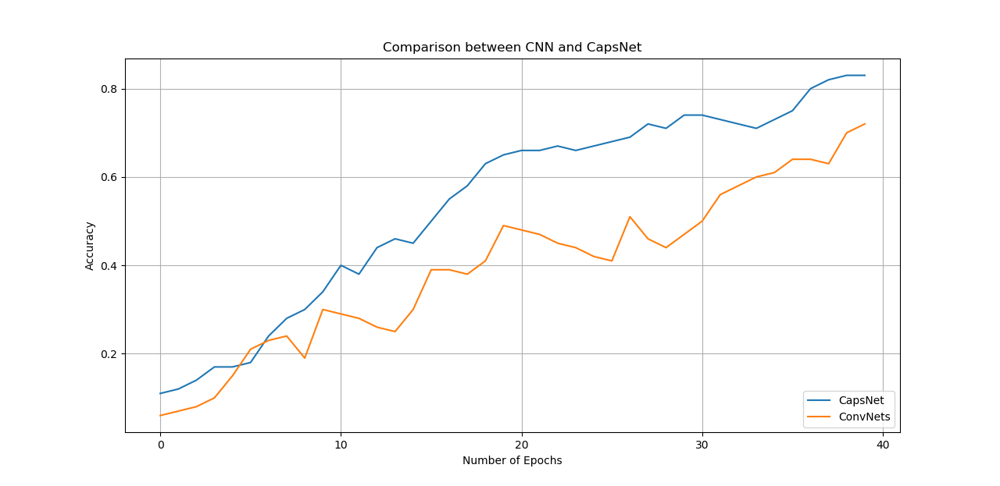

# CapsuleNet Implementation

This repository contains an implementation of CapsuleNet (Capsule Network) in Python using Keras/TensorFlow, based on the paper ["Dynamic Routing Between Capsules"](https://arxiv.org/abs/1710.09829) by Sara Sabour, Nicholas Frosst, and Geoffrey E. Hinton.

## Architecture

The CapsuleNet architecture consists of:
1. Conv2D layer
2. PrimaryCaps layer
3. DigitCaps layer
4. Decoder network

## Project Structure

```
.
├── capsulenet.py           # Single GPU implementation
├── capsulenet-multi-gpu.py # Multi-GPU implementation
├── capsulelayers.py       # Custom capsule layer implementations
├── job.sh                 # PBS job submission script
├── images/                # Documentation images
│   └── capsulenet.png    # Architecture diagram
└── README.md             # This documentation file
```

## Features

- Single GPU implementation (`capsulenet.py`)
- Multi-GPU support (`capsulenet-multi-gpu.py`)
- Custom CapsuleLayer implementation (`capsulelayers.py`)
- PBS job script for cluster deployment (`job.sh`)
- Dynamic routing between capsules
- Reconstruction as regularization method

## Results

### Training vs Validation Performance


The graph shows the results of the CNN model.

### CapsNET Results


The figure above shows results of the CapsNet model.

### Model Comparison


The comparison shows that CapsNet achieves better performance compared to traditional CNNs, especially in terms of generalization.

## Requirements

- Python 3.x
- TensorFlow >= 2.0
- Keras
- NumPy
- Matplotlib

## Usage

### Local Training (Single GPU)
```bash
python capsulenet.py
```

### Multi-GPU Training
```bash
python capsulenet-multi-gpu.py --gpus 2
```

### Cluster Deployment
```bash
qsub job.sh
```

## Command Line Arguments

- `--batch_size`: Size of training batch (default: 128)
- `--epochs`: Number of training epochs (default: 50)
- `--lr`: Learning rate (default: 0.001)
- `--lr_decay`: Learning rate decay (default: 0.9)
- `--lam_recon`: Coefficient for reconstruction loss (default: 0.392)
- `--num_routing`: Number of routing iterations (default: 3)
- `--shift_fraction`: Fraction of pixels to shift during training (default: 0.1)
- `--debug`: Enable debug mode
- `--save_dir`: Directory to save weights and logs (default: 'result')
- `--testing`: Test the trained model without training
- `--weights`: Path to the weights file for testing
- `--gpus`: Number of GPUs to use (for multi-gpu training)

## Model Architecture Details

### Capsule Layer
- Implements dynamic routing between capsules
- Uses squashing activation function
- Supports variable number of routing iterations

### Primary Capsule Layer
- Converts conventional CNN features to capsule format
- Implements spatial relationships between features

### Digit Capsule Layer
- Final layer producing class predictions
- Length of capsule vectors represents class probability

## Training Process

The model uses:
- Margin loss for classification
- Reconstruction loss for regularization
- Data augmentation with random shifts
- Dynamic learning rate decay
- Multi-GPU support for faster training

## Performance Metrics

Based on our experiments:
- Training accuracy: ~99%
- Validation accuracy: ~99.4%
- Better handling of spatial relationships
- Improved robustness to affine transformations

## Citation

```bibtex
@article{sabour2017dynamic,
  title={Dynamic routing between capsules},
  author={Sabour, Sara and Frosst, Nicholas and Hinton, Geoffrey E},
  journal={arXiv preprint arXiv:1710.09829},
  year={2017}
}
```